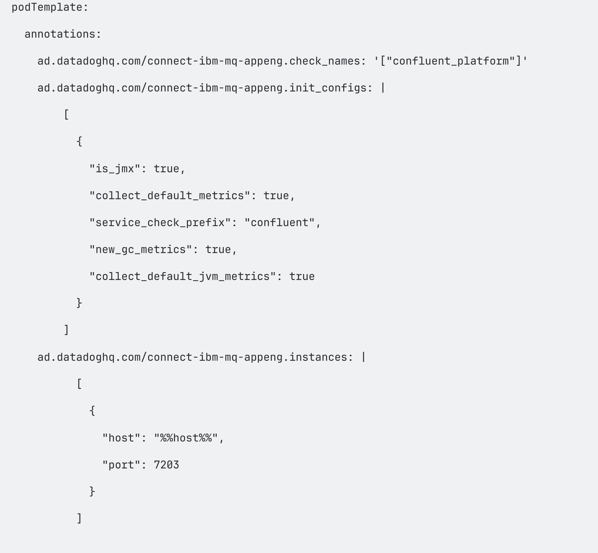

# Datadog Dashboard Build Notes (Yesterday)

This document explains exactly how the Kafka Connect Datadog dashboards in this folder were created, with direct installation and verification commands.

## Dashboards Created

1. cfk-kafka-connect-dashboard.json

- Main dashboard for runtime and JVM-level visibility.

2. cfk-kafka-connect-connector-level-dashboard.json

- Connector-level operational dashboard (running, failed, paused, throughput, and lag-proxy style trends).

## Widget Details by Dashboard

### cfk-kafka-connect-dashboard.json

- Container Memory Usage vs Limit
- Memory %
- Memory Usage
- Memory Limit
- CPU Usage vs Limit
- CPU %
- CPU Usage
- CPU Limit
- JVM Heap Memory Usage vs Max
- GC Time
- JVM Heap Used
- JVM Heap Max
- JVM Heap %
- Thread Count

### cfk-kafka-connect-connector-level-dashboard.json

- Running Connectors
- Failed Connectors
- Paused Connectors
- Task Status by Connector
- Total Tasks by Connector
- Messages/sec by Connector
- Source Active Records by Connector
- Lag Proxy by Connector
- Put Batch Avg Latency by Connector
- Put Batch Max Latency by Connector
- Error Rate by Connector
- Retry Rate by Connector
- DLQ Requests by Connector
- CPU (Worker)
- Heap Used (Worker)
- Non-Heap Used (Worker)

## Data Source and Tags

The dashboards were built from OpenMetrics metrics in the cfk namespace format:

- Metric namespace: cfk.*
- Main filters: kube_namespace:confluent and kube_container_name:connect

Example query used in widgets:

- avg:cfk.kafka_connect_connect_worker_metrics_connector_running_task_count{kube_namespace:confluent,kube_container_name:connect}

## Tags Added to Confluent Manifest Files for Datadog Integration

The JMX Datadog manifest set uses a consistent tag model in each ad.datadoghq.com instances block.

Common tags across all Confluent components:

- env:local-poc
- team:data-platform



## Actual Installation Steps

Run these commands from the repository root.

### Option A (Primary): Datadog-only using OpenMetrics

Datadog Agent scrapes OpenMetrics endpoints directly.

1. Create Datadog namespace:

```bash
kubectl apply -f monitoring/datadog/datadog-agent-namespace.yaml
```

2. Install Datadog Agent:

```bash
export DD_API_KEY=<your_datadog_api_key>
export DD_SITE=us5.datadoghq.com

helm repo add datadog https://helm.datadoghq.com || true
helm repo update datadog

helm upgrade --install datadog datadog/datadog \
  --namespace datadog-agent \
  --values monitoring/datadog/datadog-agent-values.yaml \
  --set datadog.apiKey="$DD_API_KEY" \
  --set datadog.site="$DD_SITE" \
  --wait
```

## Actual Verification Commands

Run all commands below to confirm Datadog-only readiness.

1. Verify Datadog pods:

```bash
kubectl get pods -n datadog-agent -l app=datadog
```

2. Confirm Datadog Agent image:

```bash
kubectl get pod -n datadog-agent -l app=datadog -o jsonpath='{.items[0].spec.containers[0].image}{"\n"}'
```

3. Confirm the agent loaded OpenMetrics-related configuration:

```bash
DD_POD=$(kubectl get pod -n datadog-agent -l app=datadog -o jsonpath='{.items[0].metadata.name}')
kubectl exec -n datadog-agent "$DD_POD" -- agent configcheck | sed -n '/===/p;/openmetrics/Ip'
```

4. Confirm check status from agent runtime:

```bash
kubectl exec -n datadog-agent "$DD_POD" -- agent status | sed -n '/Collector/,+160p'
```

5. Confirm Kafka Connect metrics endpoint is reachable in-cluster:

```bash
CONNECT_POD=$(kubectl get pod -n confluent -l app=connect -o jsonpath='{.items[0].metadata.name}')
kubectl exec -n confluent "$CONNECT_POD" -- sh -c 'wget -qO- http://localhost:7778/metrics | head -n 30'
```

6. Confirm CFK metrics are visible in Datadog UI:

```text
Datadog -> Metrics -> Explorer -> query: cfk.kafka_connect_connect_worker_metrics_connector_running_task_count
```

Expected: time series appears with tags that include kube_namespace:confluent.

## Dashboard Build Process Used Yesterday

1. Confirm cfk.* metrics were visible in Datadog Metrics Explorer.
2. Build and save the main dashboard as monitoring/datadog/cfk-kafka-connect-dashboard.json.
3. Build connector-focused views (grouped by connector) and save as monitoring/datadog/cfk-kafka-connect-connector-level-dashboard.json.

## Import or Restore Procedure

1. Open Datadog Dashboard List.
2. Select New Dashboard and then Import Dashboard JSON.
3. Import files in this order:

- cfk-kafka-connect-dashboard.json
- cfk-kafka-connect-connector-level-dashboard.json

4. Save and verify all widgets render data.

## Related Files

- monitoring/datadog/datadog-agent-values.yaml
- monitoring/datadog/datadog-agent-values.pre-confluent-backup.yaml
- monitoring/datadog/datadog-agent-values-static-targets.example.yaml
- docs/datadog-confluent-platform-integration.md
